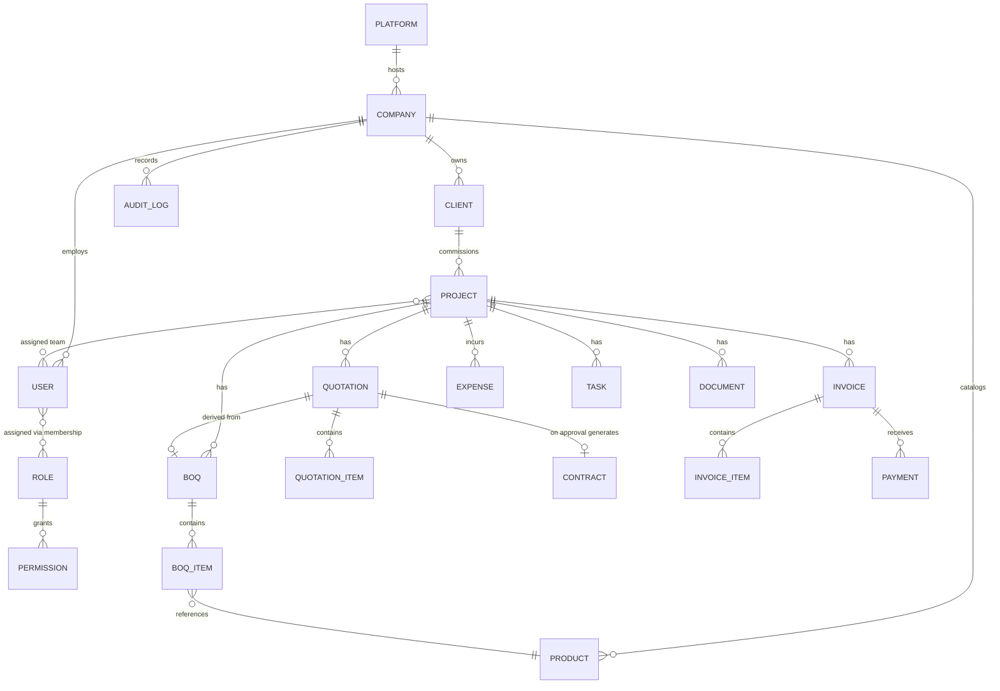
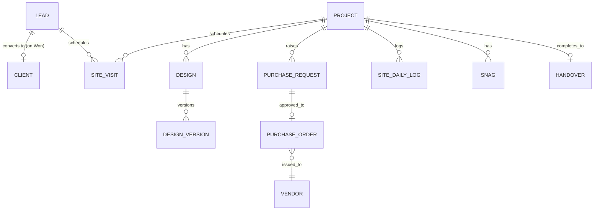

# ER Diagram (Conceptual)
## INT Projects — Multi-Company Interior & Architecture Management SaaS

**Status:** Draft — conceptual only. Physical schema is in `Database_Schema.md`; both are pending client approval of the business/functional requirements.

---

## 1. Conceptual Entity Relationship (MVP scope: Phase 1–2)

## 2. Conceptual ER (Phase 3+ additions, for future reference)

## 3. Key Relationship Rules

- Every entity below `COMPANY` in the hierarchy carries a `company_id` foreign key (tenant scope), enforced at the schema level — see `Database_Schema.md` and `05_Security/Tenant.md`.
- `CLIENT` is reusable across multiple `PROJECT`s within the same company (many projects → one client).
- `PROJECT` is the aggregation root for BOQ, Quotation, Contract, Invoice, Expense, Task, Document, and (future) Design/Site Activity/Snags.
- `QUOTATION` references its source `BOQ` (optional — a quotation may be created without a formal BOQ) and, once approved, may generate a `CONTRACT`.
- `INVOICE` is generated from an approved `QUOTATION`/`CONTRACT` and accumulates zero or more `PAYMENT`s (supports partial payment).
- `USER` ↔ `ROLE` is a many-to-many relationship scoped through **company membership** — the same person could theoretically hold different roles in different companies (e.g., a freelance accountant), so the membership record (not the user record) carries the role.

## 4. Notes

- This is a conceptual diagram to align on entities and relationships before physical schema design. It intentionally omits columns, types, and indexes — see `Database_Schema.md`.
- Do not finalize the physical schema until the Requirement Approval Gate items in `01_Business/BRS.md` §9 are signed off, since role/permission granularity and BOQ/quotation versioning rules directly affect table design.
